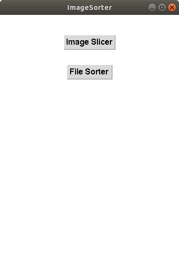
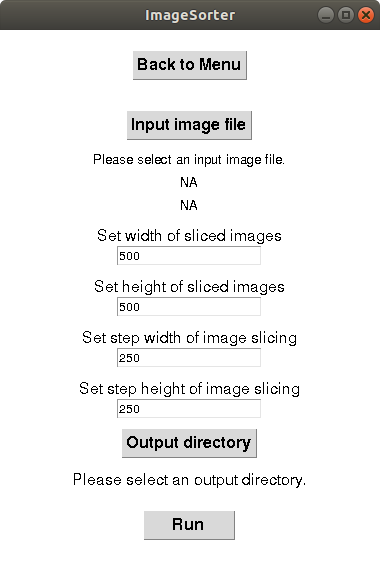
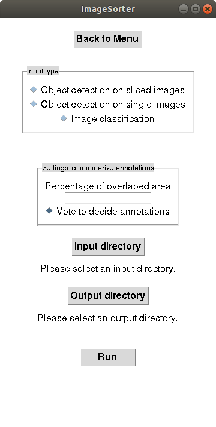

# ImageSorter
ImageSorter is a GUI-based image processing tool which provides the following functions.
1. Generate sliced images from an input image.
2. Sort image files into separate directories based on annotation information generated via [RectLabel](https://rectlabel.com/).

# Installation
Download the file in thie repository and put "CutSort.app" somewhere you like.
"CutSort.app" is an executable file on Mac OS X 10.15 or later.

# Dependencies
ImageSorter is written in Python and requires libraries listed below.  
- cv2
- scikit-image
- scipy
- numpy
- pandas
- csv
- xml

All codes are only tested using Python3.7.

The executable file of ImageSorter (ImageSorter.app) is also found in this repository.
ImageSorter.app is expected to be able to run on Windows, Mac OS, and Linux machines.

# Usage
Execute ImageSorter.app or type 
```
python /path/to/imagesorter/mian.py
```

When you execute ImageSorter, you will see a window like shown below.  
<kbd></kbd>  

Click the "Image Slicer" tab to slice a image into pieses.  
"File sorter" enable you to classify image files in an input folder into separate folders based on annotation information generated via [RectLabel](https://rectlabel.com/).  


## Image Slicer
<kbd></kbd>  

Image Slicer cuts a large image into pieces with a specified size and overlapps between images.
Please specify an input image via clicking the "Input image file" button.
The width and height of sliced images can be specified in px.

Similarly, "step width of image slicing" and "step height of image slicing" indicate how much a sliced image overlaps along the horizontal axis and the vertical axis with the next image.
If you set values as shown the image above, the first image of slices starts from the top-left corner of the input image with 500 x 500 px.
The next slice of the image will starts at the 251th pixel from the left end of the input image as specified at "Set step width of image slicing".
After the slicing hit at the right end of the input image, the next slice starts from the left end again but at the 251the pixel from the top as specified at "Set step height of image slicing".

All of the sliced images will be created in the directory specified as "Output directory".
If the directory specified at "Output directory" does not exist, it will be created.
The output directory includes an image coordinate file which shows original locations of sliced images in the input image.

## File Sorter
<kbd></kbd>

File Sorter sorts image files into separate directories based on annotations given via [RectLabel](https://rectlabel.com/).
Based on the annotation information in a json file generated by RectLabel, this function create directories and put image files.
The directory containing the input image files to be sorted should be specified as "Input directory", while "Output directory" indicates the directory under which directories will be created to sort the input image files.

File Sorter accepts three situations which input images are:
1. sliced images annotatted via an objecte detection model.
2. single (non-sliced) images annotatted via an objecte detection model.
3. single (non-sliced) images annotatted via an image classification model.

In the situation 1, a same object can be annotated as different classes in separate files of sliced images with overlaps each other.
You can select one best annotation for the object by activating the radio button "Vote to decide annotations".
In that case, "Percentage of overlapped area" need to be specified.
File Sorter algorithm first generate the original iamge from the sliced images with location information stored in an iamge coordinate file and then put all annotation information over the image. If multiple annotations indicated by rectangles are found, File Sorter evaluates whether percentages of overlaping areas covered by the annotation rectangles exceed the value specified at "Percentage of overlapped area". The annotations evaluated as "overlaps" will be merge as one annotation. If the "overlaped" annotations have conflicts, e.g. different annotations for one object, and if "Vote to decide annotaions" is active, File Sorter decides one most frequently annotatted class for the object. Otherwise, it leave two annotations for the object.
